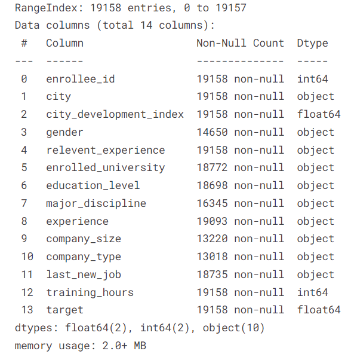
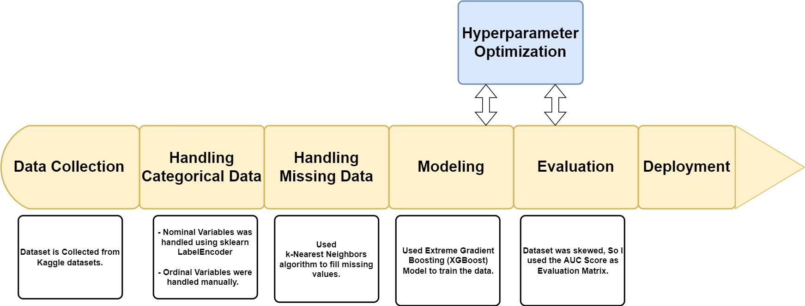
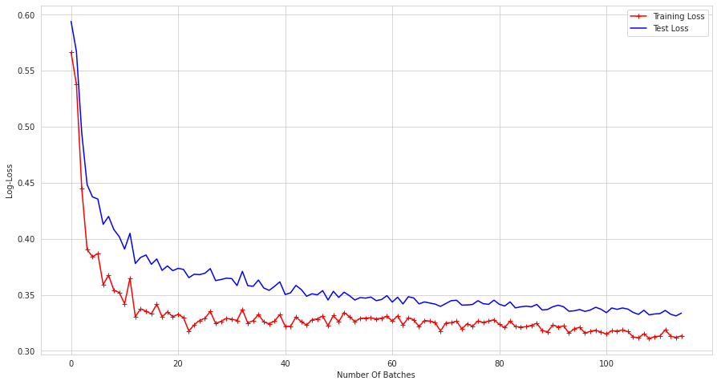
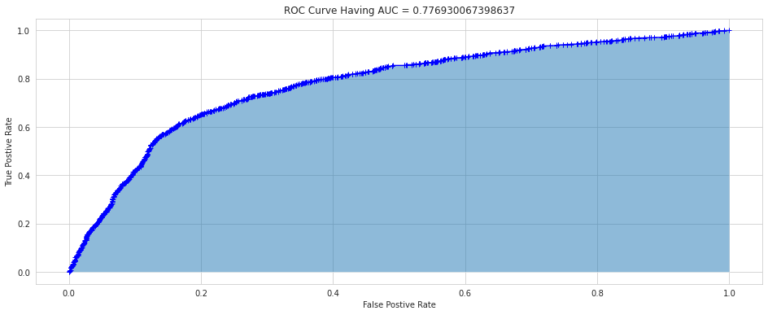

# Who will Leave a Job?

Who will leave a job is a machine learning project which predicts who will not accept the job or who will not be eligible for the job by considering a few trends of the intern during the training process. 

## Table of Content

* [About The Project](#1)
* [About Data](#2)
* [Methodology](#3)
* [Results](#4)
* [Deployment](#5)
* [Reference](#6)

## About The Project 

A company which is active in Big Data and Data Science wants to 
hire data scientists among people who successfully pass some 
courses which conduct by the company. Many people signup for 
their training. Company wants to know which of these candidates 
are really wants to work for the company after training or looking
for a new employment **because it helps to reduce the cost and time
as well as the quality of training or planning the courses** 
and categorization of candidates. 
Information related to demographics, education, experience are 
in hands from candidates signup and enrollment.

## About The Data  

The dataset used in the project is Tabular data taken from a Kaggle dataset.  
[HR Analytics: Job Change of Data Scientists](https://www.kaggle.com/datasets/arashnic/hr-analytics-job-change-of-data-scientists)

This dataset was designed to understand the factors that lead a person
to leave a current job for HR research too. By model(s) that
uses the current credentials,demographics,experience data
you will predict the probability of a candidate looking for
a new job or will work for the company, as well as interpreting 
affected factors on employee decision.

Note few points 

- The dataset is imbalanced.
- Most features are categorical (Nominal, Ordinal, Binary), some with high cardinality.
- Missing imputation can be a part of your pipeline as well.

To overcome the above challenges various approaches were used(see the notebook for more deep understanding). 

## Methodology 

For the detail Understanding of the methodology please visit the notebook present in the master repository. 

## Results 

### Learning Curve

It Help us determine if model is overfitting or underfitting.

### AUC Curve

Evaluation Results of the model.

## Deployment 

## Reference 

1. [Plots for missing values](https://towardsdatascience.com/working-with-missing-data-in-machine-learning-9c0a430df4ce)
2. [To plot dendrogram](https://coderzcolumn.com/tutorials/data-science/missingno-visualize-missing-data-in-python)
3. [Statistical Imputation for Missing Values in Machine Learning](https://machinelearningmastery.com/statistical-imputation-for-missing-values-in-machine-learning/)
4. [K-Nearest Neighbor(KNN) Algorithm for Machine Learning](https://www.javatpoint.com/k-nearest-neighbor-algorithm-for-machine-learning)
5. [Machine Learning Git repo](https://github.com/rachittoshniwal/machineLearning)
6. [Joins in Pandas](https://www.analyticsvidhya.com/blog/2020/02/joins-in-pandas-master-the-different-types-of-joins-in-python/)
7. [Handling Imbalanced Data with SMOTE](https://www.geeksforgeeks.org/ml-handling-imbalanced-data-with-smote-and-near-miss-algorithm-in-python)
8. [Encoding Methodologies](https://www.datacamp.com/community/tutorials/encoding-methodologies)
9. [Why Normalization is not required for tree based models](https://www.kaggle.com/c/m5-forecasting-accuracy/discussion/160613)
10. [SMOTE](https://imbalanced-learn.org/stable/generated/imblearn.over_sampling.SMOTE.html)
11. [Kaggle notebook for Categorical Encoding Methods](https://www.kaggle.com/arashnic/an-overview-of-categorical-encoding-methods)
12. [Interpretation of Performance Measures](https://blog.exsilio.com/all/accuracy-precision-recall-f1-score-interpretation-of-performance-measures/)
13. [How to Implement Bayesian Optimization from Scratch in Python](https://machinelearningmastery.com/what-is-bayesian-optimization/)

## Books you can study

1. [Hands–On Machine Learning with Scikit–Learn and TensorFlow 2](https://www.amazon.in/Hands-Machine-Learning-Scikit-Learn-TensorFlow-dp-1492032646/dp/1492032646/ref=dp_ob_title_bk)
2. [Approaching (Almost) Any Machine Learning Problem](https://github.com/abhishekkrthakur/approachingalmost)
